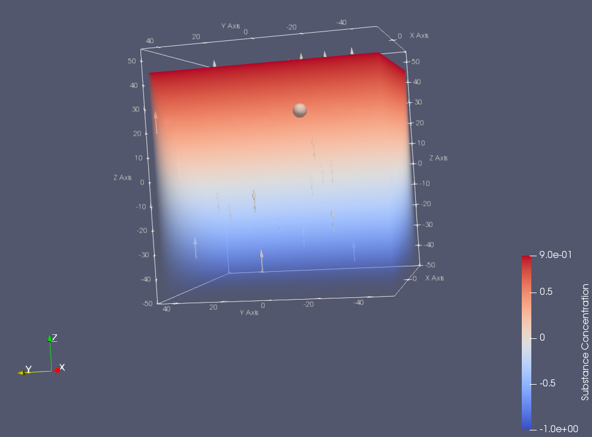

# BioDynaMo
## move_cell_along_gradient Simulation

Init a substance globaly to create a diffusion gradient for cells to move along.

Cells that move along the gradient and stop a certain levels of concentrations.
In this case at concentration >= 0.5.



## Version
```
BioDynaMo v0.1.0-135-g39a8687
```
